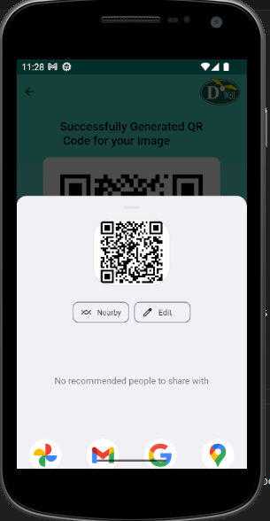

Welcome to the documentation for Dowell Image QR Code app!

Overview:
Dowell Image QR Code app allows you to generate a QR code for an image that has exactly one human face. You can download or share the generated QR code with your friends, family, and other platforms. The app uses the GetX state management and Domain-Driven Design (DDD) architecture.

Technologies:
Dart
Flutter

State Management:
The app uses the GetX state management library, which provides an easy and efficient way to manage the state of the app. This helps to keep the app fast and responsive, even when dealing with complex state changes.

Architecture:
The app uses the Domain-Driven Design (DDD) architecture, which separates the app's logic into different layers or domains. This helps to keep the code organized and easy to maintain, as well as making it more testable.

Privacy:
The Dowell Image QR Code app does not collect or store any personal information from users. The app only requires access to your device's camera and gallery to generate the QR code from the selected image.

Support:
If you have any questions or concerns about the app, please contact our support team. We are always happy to help and will do our best to respond to your queries as quickly as possible.

Getting Started
The app can be installed and tested locally using the following steps.

    Prerequisites
        Make sure flutter SDK is installed on your the local machine

    check flutter is running with no issues, using the following command

        flutter doctor
    Installation
        After the Environment is set, next download, get dependency and run the App

        Clone the repo
            git clone https://github.com/DoWellLabs/100099-Dowell-QR-code-Package.git

        Checkout the branch of the project
            git checkout branch_name
        Install dependency packages
            flutter pub get
        Connect a device and then run the app
            flutter run

Generating a QR Code:

    After successfully running the app:
    To generate a QR code, follow these steps:

    Step 1: Click the "Create QR Code" button:
    

    Step 2: Select an Image:
        Select a valid image that has exactly one human face on it. You can choose an image from your device gallery or take a new picture with your camera.

        

    Step 3: Generate the QR Code:
        Click on the "Generate QR Code" button.
        
         If the QR code is generated successfully, a new page will appear that shows the generated QR code with options to download or share the QR code. If an error occurs while generating the QR code, please check your internet connection and try again.

Downloading the QR Code:
To download the QR code, follow these steps:

    Step 1: Go to the QR Code Page:
        After the QR code is generated successfully, you will be redirected to a new page that shows the generated QR code. Click on the "Download QR Code" button.

        

    Step 2: Save the QR Code:
        The QR code will be downloaded and saved to your device's gallery.

Sharing the QR Code:
To share the QR code, follow these steps:

    Step 1: Go to the QR Code Page:
        After the QR code is generated successfully, you will be redirected to a new page that shows the generated QR code. Click on the "Share QR Code" button.

        

    Step 2: Select the Platform:
        Choose the platform where you want to share the QR code. You can choose from Telegram, Facebook, Email, WhatsApp, and other platforms.

        

    Step 3: Share the QR Code:
        After selecting the platform, you can share the QR code with an individual or a group on that platform.

Note:

    Please make sure to select a valid image that has exactly one human face on it.
    If you encounter any errors while generating the QR code, please check your internet connection and try again.
    If you have any questions or concerns regarding the app, please contact our support team.

Thank you for choosing the Dowell Image QR Code app! We hope that you find it useful and easy to use.
